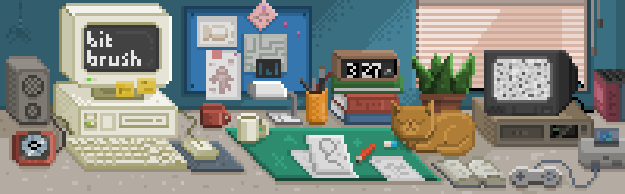

# Bit Brush



**Bit Brush** is a browser-based pixel art and sprite animation editor. It runs entirely in the browser with no installation required — open `index.html` and start drawing.

> **Live demo:** [https://derrideanauthor.github.io/BitBrush-2022/](https://derrideanauthor.github.io/BitBrush-2022/)

---

## Features

### Drawing Tools
| Tool | Description |
|------|-------------|
| **Brush** | Freehand pixel painting with 4 brush sizes (1×1 to 4×4) |
| **Eraser** | Erase pixels, also available in 4 sizes |
| **Line** | Draw straight pixel-perfect lines |
| **Rectangle** | Draw filled or outlined rectangles |
| **Ellipse** | Draw filled or outlined ellipses |
| **Fill** | Flood-fill a region with the active color |
| **Select** | Rectangular selection — cut, copy, paste, move |

### Layers
- Add, delete, reorder, and rename layers per frame
- Toggle layer visibility and lock layers
- Isolate a single layer to focus editing
- Grid and guide overlays

### Animation / Timeline
- Multi-frame animation with a built-in timeline panel
- Configurable playback speed (FPS)
- Onion skinning — ghost previous and next frames while drawing
- Frame preview minimap
- Clone frames to speed up animation work

### Color Tools
- HSL and RGB color pickers
- Primary and secondary color swatches with quick swap
- Automatic shade and tint generation
- Color harmony modes (Analogous, Complementary, etc.)
- Preset color books (e.g. Gameboy 4-color palette)
- Recent-colors history

### Export
- **PNG spritesheet** — all frames laid out in a configurable grid
- **Individual PNGs** — one file per frame
- **Animated GIF** — export your animation directly
- Frame range, rows/columns, and output size are all adjustable before export

### File Format
- Save and load projects as `.bitbr` files (proprietary JSON-based format) to preserve all layers, frames, and settings

---

## Getting Started

### Run Locally

1. Clone or download this repository.
2. Open `index.html` in any modern desktop browser (Chrome/Edge recommended).
3. Use **File → New** to create a new sprite (choose a canvas size: 16×16, 32×32, 64×64, or 128×128).
4. Pick a color, select a tool, and start drawing.

> **Note:** The app uses `querySelectorAll` and the `ImageData` constructor; these are supported in all modern browsers. Android WebView compatibility is limited.

### Keyboard Shortcuts

Keyboard shortcut support is built into the tools — refer to the tooltip overlays shown when hovering over buttons in the app.

---

## Project Structure

```
BitBrush-2022/
├── index.html               # App entry point
├── favicon.png
├── css/
│   ├── main.css             # Core layout and app styles
│   ├── panels.css           # Panel / sidebar styles
│   ├── bitbrushicons.css    # Custom icon font
│   └── materialdesignicons.min.css
├── js/
│   ├── main.js              # App bootstrap and global state
│   ├── sprite.js            # Sprite / frame / layer data model
│   ├── tools.js             # Drawing primitives (line, rect, ellipse…)
│   ├── colors.js            # Color model and conversion utilities
│   ├── header.js            # Top menu bar panel
│   ├── panels/
│   │   ├── color-panel.js   # Color picker UI
│   │   ├── frames-panel.js  # Timeline / animation panel
│   │   ├── layers-panel.js  # Layers / document panel
│   │   ├── tools-panel.js   # Drawing & editing tools toolbar
│   │   ├── history-panel.js # Undo / redo history
│   │   ├── components.js    # Reusable UI component primitives
│   │   ├── new-menu-panel.js    # New project dialog
│   │   └── export-menu.js   # Export dialog
│   ├── gif_encoder/         # Client-side GIF encoding library
│   ├── filesaver/           # FileSaver.js + JSZip for downloads
│   └── animation/           # requestAnimationFrame polyfill
├── assets/
│   ├── images/              # UI images, logos, backgrounds
│   ├── icons/               # Icon assets
│   ├── ui/                  # UI asset files
│   └── presets/
│       ├── swatches.js      # Built-in color palette presets
│       ├── tooltips.js      # Tooltip text definitions
│       └── render-ui.js     # UI layout rendering
├── Versions                 # Changelog (version list)
└── notes.txt                # Developer notes and todo list
```

---

## Version History

| Version | Notes |
|---------|-------|
| 0.1.5 | Current release (Beta) |
| 0.1.4 | |
| 0.1.3 | |
| 0.1.2 | |
| 0.1.1 | Initial tracked version |

---

## Known Limitations & Planned Improvements

- Maximum of ~50 layers recommended
- Circle tool skips every second pixel in some cases (known rendering quirk)
- `ImageData` constructor may not work on older Android WebView versions
- Future plans include: text-mode icons, drag on color panel, reference image layers, constrained drawing with Shift key, ALT-action on line tool

---

## Tech Stack

- **Vanilla JavaScript** (ES5/ES6) — no frameworks or build step required
- **HTML5 Canvas API** — all rendering is done via 2D canvas contexts
- **GIFEncoder.js** — client-side animated GIF encoding
- **FileSaver.js + JSZip** — in-browser file download and zip packaging
- **Material Design Icons** + custom Bit Brush icon font

---

## License

This project does not currently include a license file. All rights reserved by the author unless otherwise stated.
